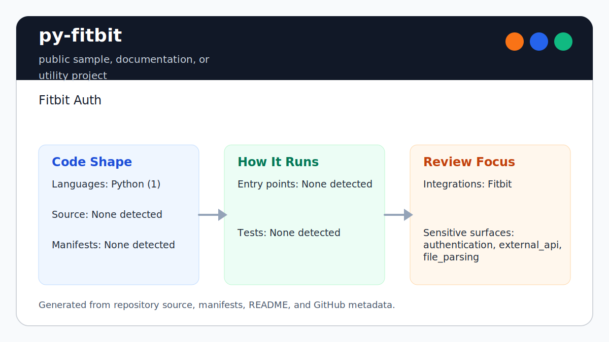

# py-fitbit

<!-- README-OVERVIEW-IMAGE -->


## Overview

`garethpaul/py-fitbit` is a public sample, documentation, or utility project. Fitbit Auth

This README is based on the checked-in source, manifests, scripts, and repository metadata on the `master` branch. The project language mix found during review was: Python (1).

## Repository Contents

- `README.md` - project overview and local usage notes
- `.github/workflows/check.yml` - pinned Python 2.7 hosted verification
- `CHANGES.md` - notable maintenance changes
- `Makefile` - local verification entry points
- `docs/plans` - canonical completed maintenance plans
- `plans` - completed maintenance plans
- `scripts` - deterministic legacy safety checks
- `SECURITY.md` - security reporting and disclosure guidance
- `tests` - Python 2 mock-based tests for the legacy OAuth request path
- `VISION.md` - project direction and maintenance guardrails

Additional scan context:

- Source directories: scripts, tests
- Dependency and build manifests: Makefile
- Entry points or build surfaces: fitbit.py, Makefile
- Test-looking files: scripts/check_legacy_fitbit.py, tests/test_fitbit_oauth_request.py

## Getting Started

### Prerequisites

- Git
- Python 2.7 for the legacy sample syntax check
- Python 3 for repository safety checks
- `make`

### Setup

```bash
git clone https://github.com/garethpaul/py-fitbit.git
cd py-fitbit
```

The setup commands above are derived from repository files. Legacy mobile, Python, or JavaScript samples may require older SDKs or package versions than a modern workstation uses by default.

## Running or Using the Project

- Create a local, untracked `settings.py` with `CONSUMER_KEY` and `CONSUMER_SECRET`.
- Run `fitbit.py` with Python 2.7 if you need to exercise the legacy OAuth 1 flow.
- OAuth request, access-token, and authorization endpoints are pinned to
  `https://api.fitbit.com`.
- Pass protected-resource calls as Fitbit API paths such as
  `/1/user/-/profile.json`; absolute URLs and scheme-relative URLs are rejected
  before a network connection is opened.
- Protected-resource paths are trimmed at the edges but must not contain raw
  whitespace or control characters.
- Protected-resource paths must not include URL fragments.
- Protected-resource paths must not include raw or percent-encoded `.` or `..`
  path segments.
- Protected-resource paths must not include credential query parameters such as
  `oauth_token`, `access_token`, or `client_secret`; OAuth credentials belong
  in the signed request header or local settings.
- `access_token.string` is a local token cache, must stay untracked, and is
  written with owner-only permissions. Existing token-cache files with group or
  other permissions are rejected before a Fitbit network request is opened.
- OAuth token exchanges and protected resource calls reject non-2xx HTTP
  responses without including the upstream response body in the exception.
- OAuth and protected-resource paths use bounded response reads of 1 MiB plus
  one detection byte and reject oversized credential or health-data payloads.
- OAuth and protected-resource response objects are closed after every read
  attempt, including status, size, and transport failures.
- Created HTTPS connections are closed exactly once after cached-token or
  interactive OAuth calls finish, including failure paths.
- Interactive authorization never prints OAuth token secrets. Optional debug
  output reports only request methods, response statuses, and response sizes;
  it does not print signed URLs or raw token response bodies.

## Testing and Verification

- Run `make check` before committing changes.
- Run `make build` for the static legacy verification gate; it uses the same
  mocked Python 2 tests as `make test`.
- GitHub Actions runs the complete `make check` gate in a digest-pinned Python
  2.7.18 container for every push and pull request.
- `make check` delegates to `make verify`, which compiles the Python 2 source, checks that credential/token handling stays local, keeps debug logging disabled by default, runs mocked OAuth request, request-token flow, API path validation, and token-cache tests without contacting Fitbit, and verifies completed plans under `docs/plans`.
- The test target disables Python bytecode writes, and the legacy safety check
  rejects checked-out `.pyc` files or `__pycache__` directories.
- GitHub Actions runs the complete gate in the official Python 2.7.18 image,
  pinned by digest, with read-only repository permissions. The job does not
  skip Python 2 compilation or the fifteen mocked OAuth tests.

When the required SDK or runtime is unavailable, use static checks and source review first, then verify on a machine that has the matching platform toolchain.

## Configuration and Secrets

- Detected references to Fitbit. Keep API keys, OAuth credentials, tokens, and account-specific values in local configuration only.

## Security and Privacy Notes

- Review changes touching authentication or token handling; examples from the scan include fitbit.py.
- Review changes touching external API calls or credential-adjacent configuration; examples from the scan include fitbit.py.
- Review changes touching file, media, JSON, XML, CSV, OCR, or data parsing; examples from the scan include fitbit.py.
- Protected Fitbit resource paths reject embedded whitespace before network
  requests are opened.
- Protected Fitbit resource paths reject fragments before network requests are
  opened.
- Protected Fitbit resource paths reject raw and percent-encoded `.` and `..`
  path segments before network requests are opened.
- Protected Fitbit resource paths reject credential query parameters before
  network requests are opened.
- Existing `access_token.string` files must be owner-only; readable-by-group or
  readable-by-other cache files are rejected before network requests are
  opened.
- Token-cache reads and writes reject symbolic links, and read permissions are
  checked on the opened file descriptor. All dangling token-cache symlinks are
  included in cache existence checks and rejected before network access.

## Maintenance Notes

- See `SECURITY.md` for vulnerability reporting and safe research guidance.
- See `VISION.md` for project direction and contribution guardrails.
- See `docs/plans/2026-06-08-py-fitbit-baseline.md` for the canonical legacy
  safety and mocked OAuth request baseline.
- See `docs/plans/2026-06-08-token-cache-permissions.md` for the token-cache
  permissions baseline.
- See `docs/plans/2026-06-08-request-token-flow-test.md` for the mocked
  no-cache OAuth flow baseline.
- See `docs/plans/2026-06-09-api-call-path-validation.md` for the protected
  resource API path guard.
- See `docs/plans/2026-06-09-api-call-whitespace-validation.md` for the
  protected resource path whitespace guard.
- See `docs/plans/2026-06-09-api-call-fragment-validation.md` for the
  protected resource path fragment guard.
- See `docs/plans/2026-06-09-api-call-dot-segment-validation.md` for the
  protected resource path dot-segment guard and static `make build` alias.
- See `docs/plans/2026-06-09-api-call-credential-query-validation.md` for the
  protected resource path credential-query guard.
- See `docs/plans/2026-06-09-oauth-endpoint-https.md` for the OAuth endpoint
  HTTPS guard.
- See `docs/plans/2026-06-09-bytecode-free-verification.md` for the
  bytecode-free legacy verification guard.
- See `docs/plans/2026-06-10-ci-baseline.md` for the pinned full Python 2
  GitHub Actions baseline.
- See `docs/plans/2026-06-10-token-cache-read-permissions.md` for the
  token-cache read permission guard.
- See `docs/plans/2026-06-10-hosted-legacy-validation.md` for digest-pinned,
  full Python 2.7 hosted verification.
- See `docs/plans/2026-06-10-http-status-validation.md` for OAuth and protected
  resource response status validation.
- See `docs/plans/2026-06-12-response-body-size-boundary.md` for bounded
  response reads across OAuth and protected-resource requests.
- See `docs/plans/2026-06-13-response-close-contract.md` for deterministic
  response cleanup across success and failure paths.
- See `docs/plans/2026-06-13-token-cache-symlink-guard.md` for descriptor-based
  permission checks and symbolic-link rejection.
- See `docs/plans/2026-06-13-https-connection-close.md` for complete shared
  HTTPS connection cleanup after each client call.

## Contributing

Keep changes small and tied to the project that is already present in this repository. For code changes, document the toolchain used, avoid committing generated dependency directories or local configuration, and update this README when setup or verification steps change.
